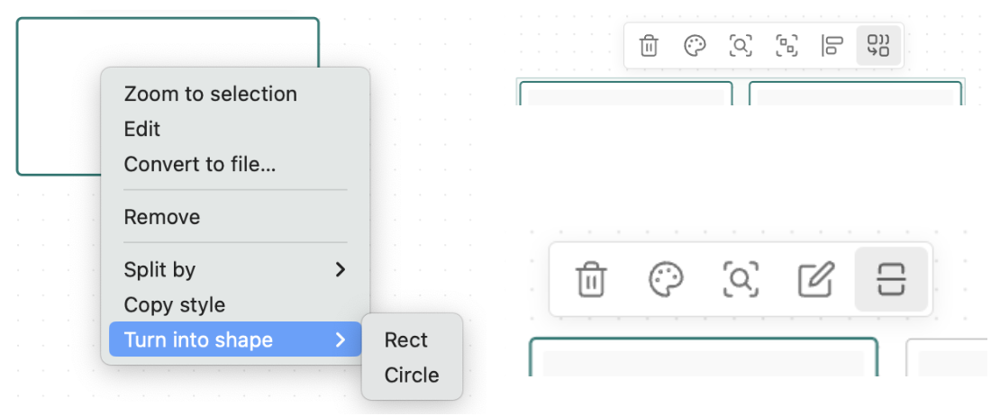

# Enchanted Canvas

This is a plugin for Obsidian that extends the functionality of the built-in [canvas-plugin](https://obsidian.md/canvas).


Current features:

-   Copying styles
-   Merging and splitting cards
-   Custom shapes, currently only square and circle
-   Hotkey for creating new cards or stickers in a row
-   Patched context menu and popup menu:
    

There are bugs and glitches.

To-Do:

-   [ ] Fix history for custom nodes
-   [ ] Fix CSS, especially for circles
-   [ ] Remove duplicate edges when merging nodes
-   [x] Fix isEditing bug after node splitting

## Usage

1. Build
    ```bash
    git clone git@github.com:borolgs/enchanted-canvas.git
    pnpm i
    pnpm build
    ```
2. Copy the contents of the dist folder to path/to/vault/.obsidian/plugins/enchanted-canvas.
3. Enable the plugin:  
   Settings -> Community plugins:
    - Turn on community plugins
    - Under Installed plugins, enable the **Enchanted Canvas**

## How it Works

Canvas emits several events that we need:

-   `canvas:edge-menu`
-   `canvas:selection-menu`
-   `canvas:node-menu`
-   `canvas:node-connection-drop-menu`

For anything that's missing, we can emit it ourselves by overriding the canvas and node prototypes.  
For example, adding the `canvas:node:initialize` event:

```js
const nodePrototype = getNodePrototype(canvas);

nodePrototype.initialize = new Proxy(nodePrototype.initialize, {
  apply: (target, thisArg, argumentsList) => {
    plugin.app.workspace.trigger('canvas:node:initialize', thisArg);
    return Reflect.apply(target, thisArg, argumentsList);
  },
});
```

We can hope that in the future, these events will become part of the public API.  
And we can all build unique tools to suit our needs.

Next, by subscribing to these events, we can extend their context menus:

```js
this.registerEvent(
  workspace.on('canvas:node-menu', (menu: Menu, node: CanvasNode) => {
    menu.addSeparator();
    menu.addItem((item) =>
      item
        .setTitle('Copy style')
        .setSection('extra')
        .onClick(() => {
          // Some node action
        })
    );
  })
);
```

For the business logic layer, I use [effector.js](https://beta.effector.dev), but it's not mandatory.  
You can do it your way:

```js
// Create Node Effect
const createNextNodeFx = createEffect(({ node }: { node: CanvasNode }) => {
  const { canvas } = node;
  const next = canvas.createTextNode({
    pos: { x: node.x, y: node.y + node.height + 10 },
    text: '',
    size: { width: node.width, height: 50 },
  });

  next.setColor(node.color);
  canvas.requestSave();
});

sample({
  // On alt + enter
  clock: hotkey({ modifiers: 'alt', key: 'Enter' }),
  // Use canvas
  source: $canvas,
  // If selection is empty or contains not text nodes: skip
  filter: (canvas) => {
    if (canvas.selection.size !== 1) return false;

    const node = Array.from(canvas.selection)[0];
    if (!isTextNode(node) || !node.isEditing) {
      return false;
    }

    return true;
  },
  // Take first node from canvas selection
  fn: (canvas) => ({
    canvas: canvas!,
    node: Array.from(canvas!.selection)[0],
  }),
  // Run Effect
  target: createNextNodeFx,
});

createNextNodeFx.fail.watch(({ error }) => {
  console.error(error);
});
```
